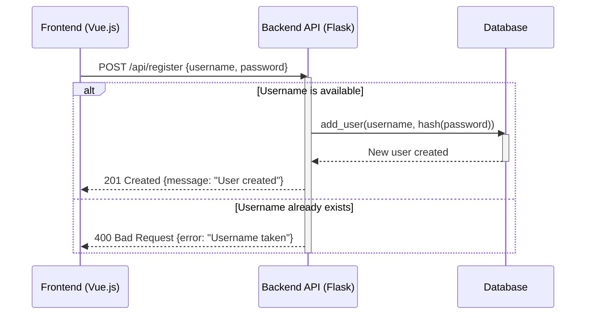
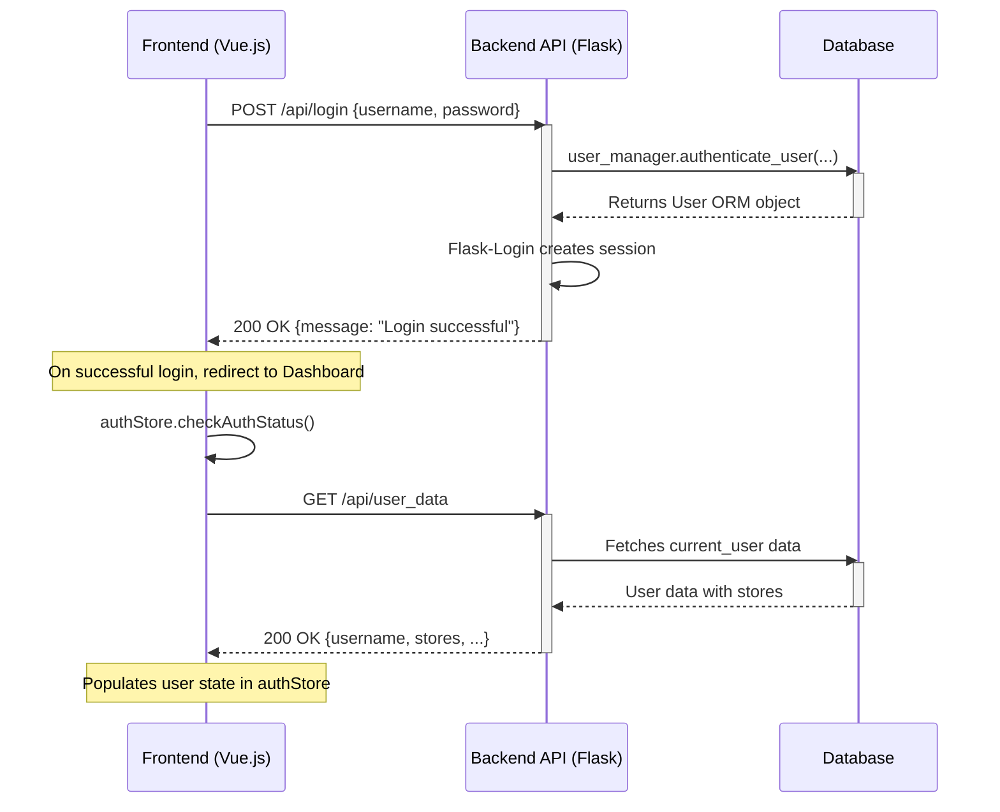
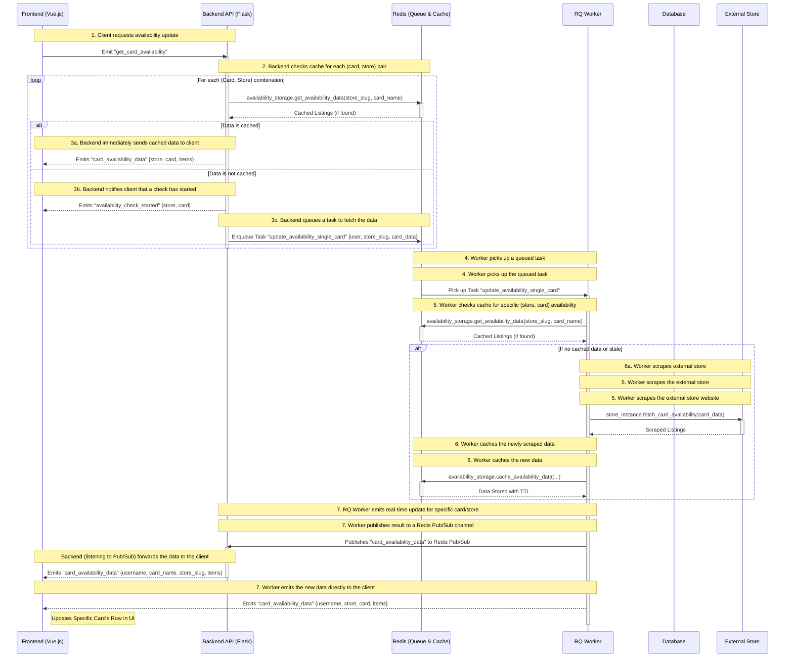
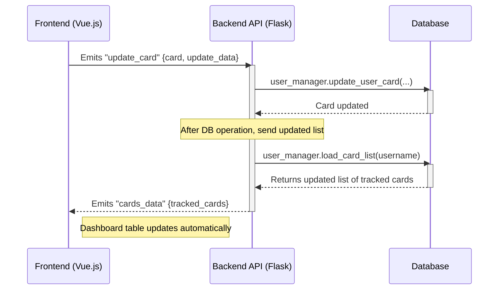
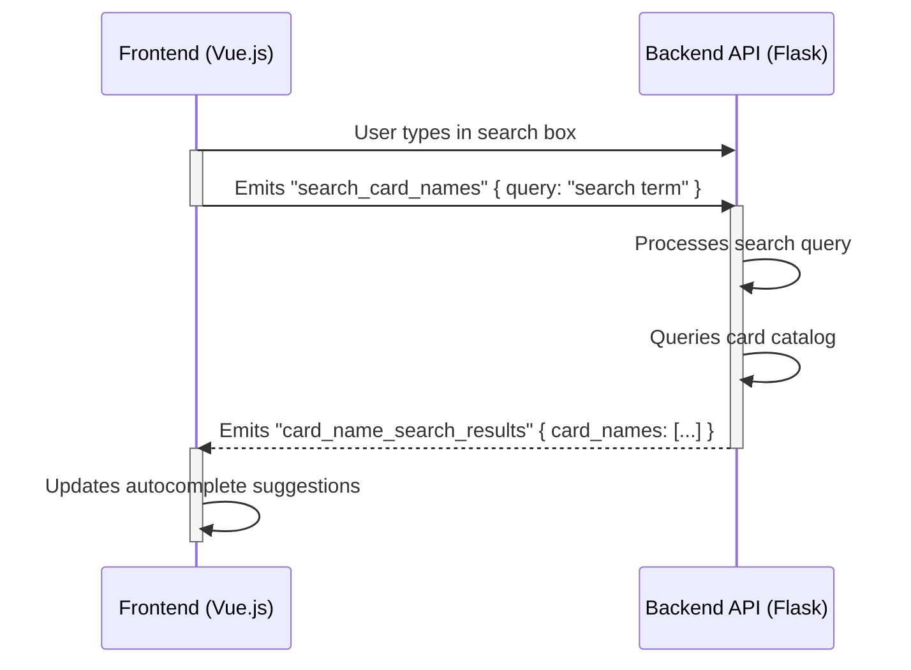
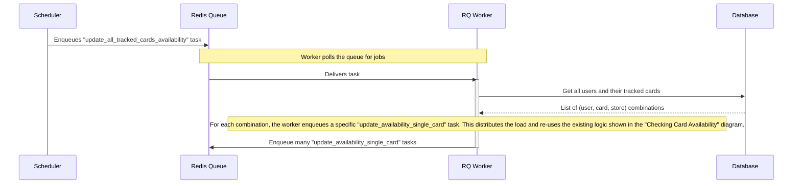
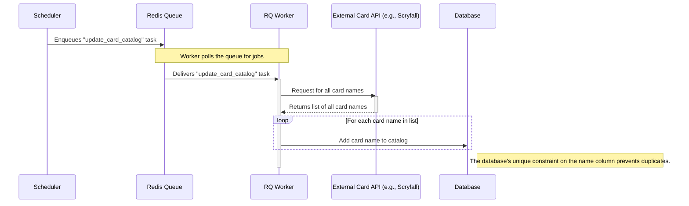
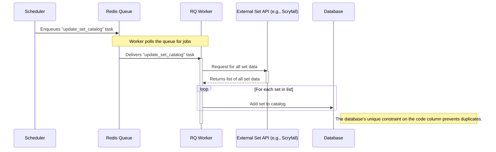
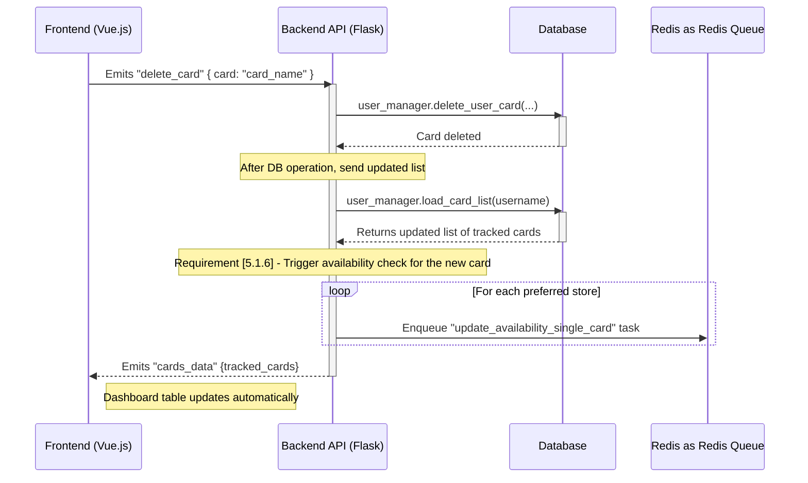

# LGS Stock Checker

## Architecture Overview

This project follows a modern client-server architecture with a decoupled frontend and a backend API, supported by background workers for intensive tasks.

### Architecture Definitions

*   **Frontend (Vue.js SPA)**: A Single Page Application that provides the user interface. It communicates with the backend via a RESTful API for standard requests (like login) and WebSockets for real-time, bidirectional events (like adding a card or receiving availability updates). It is responsible for all presentation logic.

*   **Backend (Flask API)**: The central server that handles business logic, authentication, and orchestrates operations. It exposes REST endpoints for standard CRUD operations and manages WebSocket connections. When a user requests an action that requires a background job (like checking card availability), the backend's primary role is to queue that task and immediately return a response to the client. It does not perform the heavy lifting itself.

*   **Database (PostgreSQL)**: The system's source of truth for all persistent data. This includes user accounts, tracked cards, store information, and the global card/set catalogs.

*   **Task Queue (Redis & RQ)**: A Redis-backed queue managed by the Python RQ (Redis Queue) library. The backend places long-running or intensive jobs (like web scraping) onto the queue to be processed asynchronously. This ensures the API remains responsive.

*   **Worker (RQ Worker)**: A separate process that listens to the Task Queue. It picks up jobs as they are added and executes them. This is where tasks like scraping external store websites or updating catalogs from an external API actually happen. After completing a job, the worker can emit results directly back to the client via a worker-safe WebSocket emitter.

*   **Cache (Redis)**: A Redis instance used for caching temporary data, most notably the results of web scraping for card availability. This prevents the system from repeatedly scraping the same store for the same card, reducing external requests and improving response time.

### Backend System Layers

The backend application is structured into distinct layers to enforce a clear separation of concerns and a unidirectional data flow. This makes the system easier to test, maintain, and reason about.

*   **Handlers (Controller Layer)**: Located in `managers/socket_manager/socket_handlers.py`. This is the entry point for all client communication via WebSockets. Its responsibilities are to:
    *   Receive incoming requests.
    *   Validate the shape of the incoming data (using Pydantic).
    *   Call the appropriate Manager to handle the business logic.
    *   Emit results or status updates back to the client.

*   **Managers (Service Layer)**: Located in the `managers/` directory (e.g., `availability_manager`, `user_manager`, `task_manager`). This layer contains the core business logic of the application. Its responsibilities are to:
    *   Orchestrate complex operations.
    *   Interact with the Data Layer to fetch or persist information.
    *   Use the `task_manager` to queue background jobs by their string ID.
    *   **Data Flow Rule**: Managers should **never** import directly from the `tasks` or `handlers` layers.

*   **Tasks (Worker Layer)**: Located in the `tasks/` directory. These are the functions that are executed asynchronously by the RQ Workers. Their responsibilities are to:
    *   Perform long-running or I/O-bound operations (e.g., web scraping, calling external APIs).
    *   Interact with the Data Layer and Managers as needed.
    *   Use the worker-safe `socket_emit` module to send results back to the client.

### Sequence Diagrams 

#### User Registration Flow
This diagram shows the sequence for adding a new user.

#### User Authentication Flow

This diagram shows the sequence for a user logging in and the frontend being populated with their data.

#### Adding a New Tracked Card

When a user adds a new card, the following sequence of operations occurs across the system components:

#### Checking Card Availability
When a check availability has been triggered.

#### Updating a Tracked Card

#### Card Search Flow

#### Scheduled Card Availability Check 
This diagram illustrates the scheduled background task for periodically re-checking all tracked cards, fulfilling requirement [5.1.7]. 

#### Background Card Catalog Update 

This diagram illustrates the scheduled background task for populating the global card catalog from an external source, fulfilling requirements `[4.1.6]` and `[4.1.7]`. 

#### Background Set Catalog Update

This diagram illustrates the scheduled background task for populating the set catalog from an external source.

#### Delete a Tracked Card

### Messages Sent Between Components
The frontend and backend communicate via two primary methods: a RESTful API for standard requests and Socket.IO for real-time, bidirectional events. 

#### REST API Endpoints

| Method | Endpoint | Description | 
|--------|---------------------------------|------------------------------------------------------| 
| POST | /api/login | Authenticates a user and creates a session. | 
| POST | /api/logout | Logs out the current user. | 
| GET | /api/user_data | Retrieves the logged-in user's profile data. | 
| GET | /api/stores | Returns a list of all available store slugs. | 
| POST | /api/account/update_username | Updates the logged-in user's username. | 
| POST | /api/account/update_password | Updates the logged-in user's password. | 
| POST | /api/account/update_stores | Updates the logged-in user's preferred stores. |

#### Socket.IO Events 
| Event Name | Direction | Data Payload | Description | 
|------------------------------|-------------------|---------------------------------------------|--------------------------------------------------------------------------| 
| connect | Client -> Server | - | Establishes a WebSocket connection. | 
| get_cards | Client -> Server | - | Requests the user's full list of tracked cards. | 
| cards_data | Server -> Client | { "tracked_cards": [...] } | Sends the full list of tracked cards to the client. | 
| add_card | Client -> Server | { "card", "amount", "card_specs" } | Adds a new card to the user's tracked list. | 
| update_card | Client -> Server | { "card", "update_data": {...} } | Updates the amount or specifications of a tracked card. | 
| delete_card | Client -> Server | { "card": "..." } | Deletes a card from the user's tracked list. | 
| search_card_names | Client -> Server | { "query": "..." } | Requests a list of card names matching a partial search query. | 
| card_name_search_results | Server -> Client | { "card_names": [...] } | Returns a list of autocomplete suggestions for the card search. | 
| get_card_availability | Client -> Server | - | Triggers background tasks to check for card availability. | 
| availability_check_started | Server -> Client | { "store", "card" } | Notifies the UI that a check has begun for a specific item. | 
| card_availability_data | Server -> Client | { "store", "card", "items": [...] } | Sends real-time availability results for a specific card and store. |