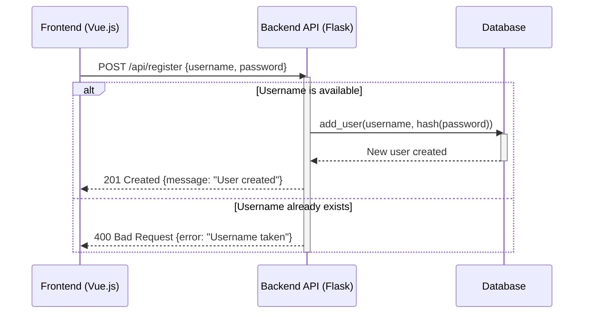
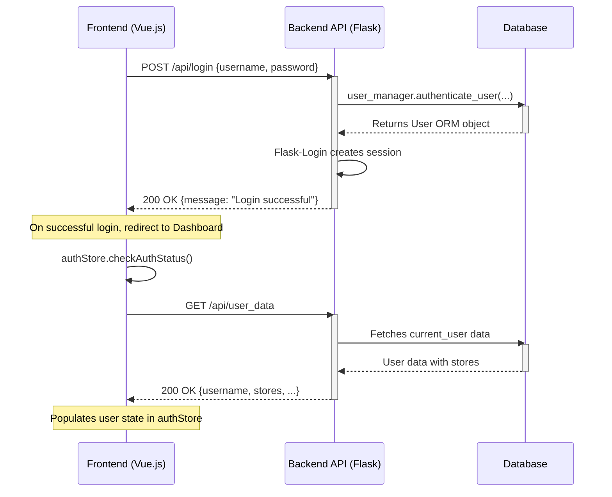
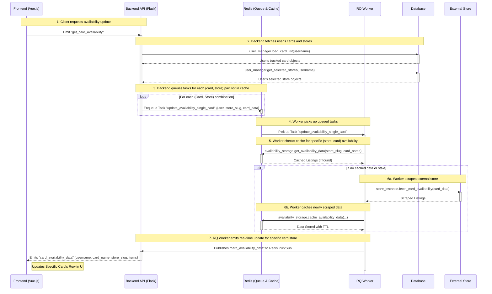
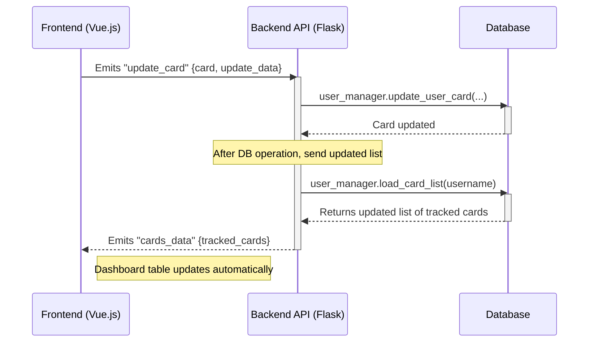
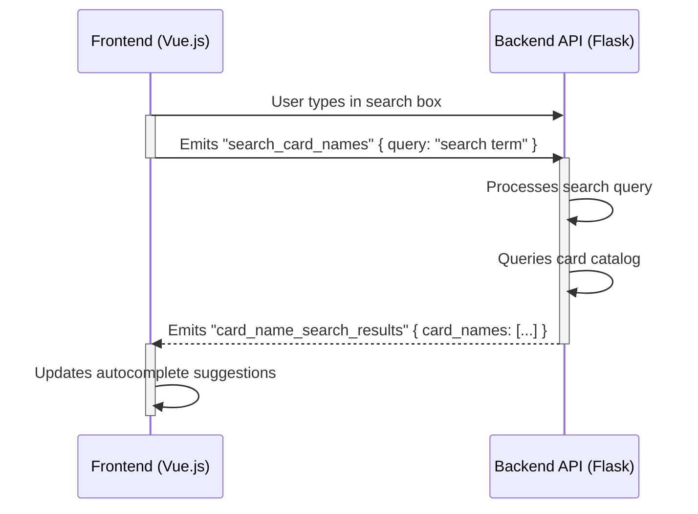
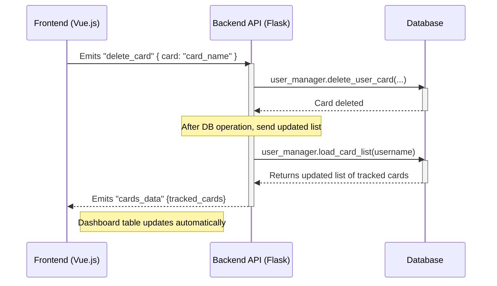

# LGS Stock Checker

## Architecture Overview

This project follows a modern client-server architecture with a decoupled frontend and a backend API, supported by background workers for intensive tasks.

### Sequence Diagrams 

#### User Registration Flow
This diagram shows the sequence for adding a new user.

#### User Authentication Flow

This diagram shows the sequence for a user logging in and the frontend being populated with their data.

#### Adding a New Tracked Card

When a user adds a new card, the following sequence of operations occurs across the system components:

#### Checking Card Availability
When a check availability has been triggered.

#### Updating a Tracked Card

#### Card Search Flow

#### Delete a Tracked Card

### Messages Sent Between Components
The frontend and backend communicate via two primary methods: a RESTful API for standard requests and Socket.IO for real-time, bidirectional events. 

#### REST API Endpoints

| Method | Endpoint | Description | 
|--------|---------------------------------|------------------------------------------------------| 
| POST | /api/login | Authenticates a user and creates a session. | 
| POST | /api/logout | Logs out the current user. | 
| GET | /api/user_data | Retrieves the logged-in user's profile data. | 
| GET | /api/stores | Returns a list of all available store slugs. | 
| POST | /api/account/update_username | Updates the logged-in user's username. | 
| POST | /api/account/update_password | Updates the logged-in user's password. | 
| POST | /api/account/update_stores | Updates the logged-in user's preferred stores. |

#### Socket.IO Events 
| Event Name | Direction | Data Payload | Description | 
|------------------------------|-------------------|---------------------------------------------|--------------------------------------------------------------------------| 
| connect | Client -> Server | - | Establishes a WebSocket connection. | 
| get_cards | Client -> Server | - | Requests the user's full list of tracked cards. | 
| cards_data | Server -> Client | { "tracked_cards": [...] } | Sends the full list of tracked cards to the client. | 
| add_card | Client -> Server | { "card", "amount", "card_specs" } | Adds a new card to the user's tracked list. | 
| update_card | Client -> Server | { "card", "update_data": {...} } | Updates the amount or specifications of a tracked card. | 
| delete_card | Client -> Server | { "card": "..." } | Deletes a card from the user's tracked list. | 
| search_card_names | Client -> Server | { "query": "..." } | Requests a list of card names matching a partial search query. | 
| card_name_search_results | Server -> Client | { "card_names": [...] } | Returns a list of autocomplete suggestions for the card search. | 
| get_card_availability | Client -> Server | - | Triggers background tasks to check for card availability. | 
| availability_check_started | Server -> Client | { "store", "card" } | Notifies the UI that a check has begun for a specific item. | 
| card_availability_data | Server -> Client | { "store", "card", "items": [...] } | Sends real-time availability results for a specific card and store. |