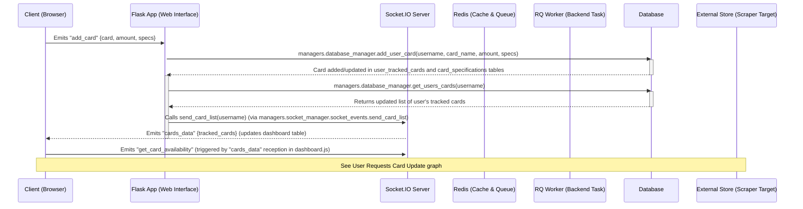
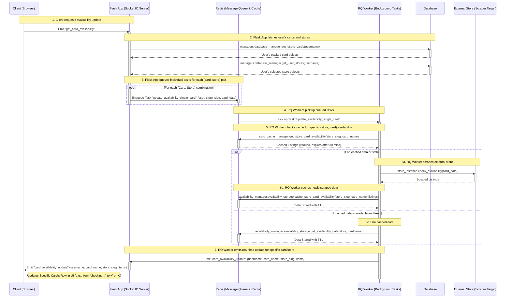
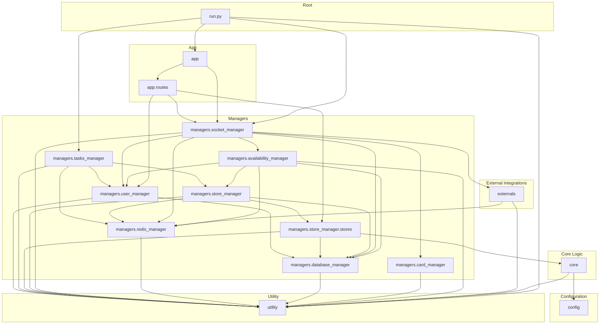

# LGS Stock Checker

## Architecture Overview

This project follows a client-server architecture to provide real-time stock availability updates for trading cards.

### Adding a New Card Flow

When a user adds a new card, the following sequence of operations occurs across the system components:

### User Requests Card Update

### Messages Sent Between Components

| Message Name                          | Message Data                                      | Target         | Description                                                          |
|---------------------------------------|---------------------------------------------------|----------------|----------------------------------------------------------------------|
| `add_card`                            | `card`, `amount`, `specs`                         | FlaskApp       | Adds a new card to the user's tracked cards.                         |
| `cards_data`                          | `tracked_cards`                                   | ClientBrowser  | Updates the dashboard table with the latest list of tracked cards.   |
| `get_card_availability`               | `card_name`, `store_slug`                         | FlaskApp       | Requests availability data for a specific card in a store.           |
| `card_availability_update`            | `card_name`, `store_slug`, `items`                | ClientBrowser  | Updates the availability status of a specific card in the dashboard. |
| `delete_card`                         | `card`                                            | FlaskApp       | Deletes a card from the user's tracked cards.                        |
| `update_card`                         | `card`, `update_data`                             | FlaskApp       | Updates the amount of a tracked card.                                |
| `get_user_stores`                     | `username`                                        | FlaskApp       | Retrieves the user's selected stores.                                |
| `get_users_cards`                     | `username`                                        | FlaskApp       | Retrieves the user's tracked cards.                                  |
| `save_store_availability_single_item` | `username`, `store_slug`, `card_name`, `listings` | Redis          | Saves the availability data for a specific card in a store.          |
| `load_data`                           | `key`, `field`                                    | Redis          | Loads cached data from Redis.                                        |
| `connect`                             | `url`                                             | SocketIOServer | Establishes a WebSocket connection with the client.                  |

## Appendix
### Import graphs
